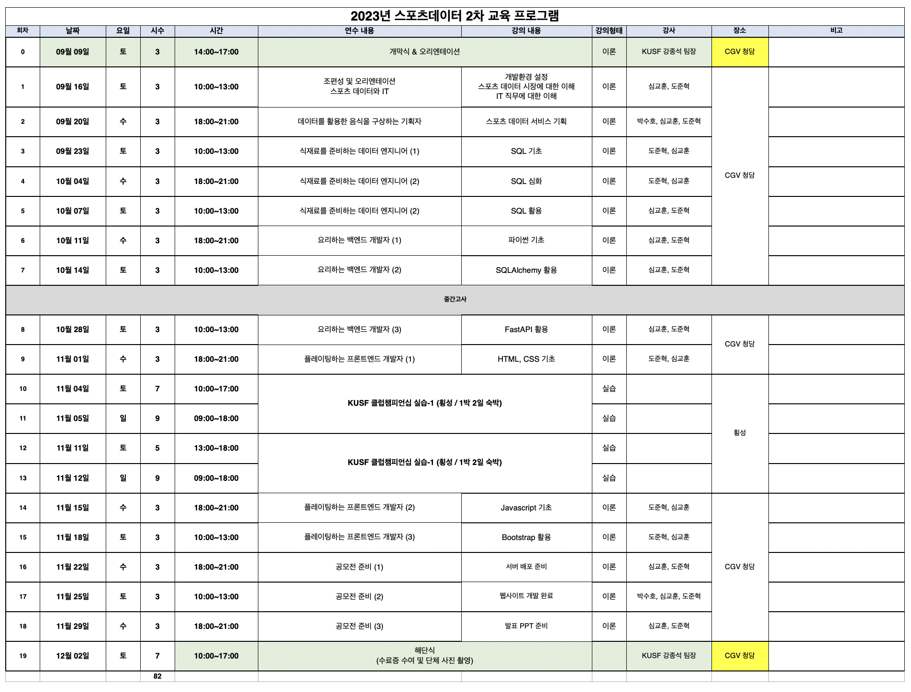

# 2023-2 KUSF 강의 개발계

## 강사진

- 심교훈
- 도준혁
- 박수호

---

## 일정

- 2023-08-29 18:00-20:40 면접 (심교훈 참가)
- 2023-09-16 강의시작
- 2023-09-20 수호
- 2023-09-23 수호(2시간), 준혁(1시간)
- 2023-11-08: 강의 추가될 수도 있음
- 2023-12-02 공모전

---

## 강의자료 준비

- 코드 위주의 강의 자료이므로 생산성을 높이기 위해 모든 강의자료는 markdown으로 작성한다.
- 강의자료를 업로드할 때는 PDF 파일로 변환하여 업로드한다. (vscode의 markdown PDF extension 활용)
  - PDF로 변환하는 이유는 markdown으로 작성된 강의 자료를 아래로 끊임없이 스크롤링 해가며 강의를 진행할 경우 학생들의 집중도가 많이 떨어지기 때문.
- 이미지는 상대 경로로 images 폴더에 저장하고 markdown 문서에서 참조. 이미지명은 01_1.png와 같이 {강의회차}_{이미지번호}.png 형태로 작명.

---

## 강의 준비물

- 노트북
- hdmi 컨버터

---

## 브랜치 전략

- lecture/sim, lecture/do branch에서 각각 작업 한 후 master/main 브랜치로 PR 올릴 것.
  - 최소 한번이라도 다른 강사의 강의자료를 확인하게 하기 위한 장치.
  - PR 리뷰어 설정하기 위해서 레포지토리를 public으로 설정함.

---

## 개발 환경 정리

- 로컬: 파이썬, HTML, JS, CSS 개발 등
  - 파이썬 설치
  - VSCODE 설치
  - DBeaver 설치
- DB: 서버리스 MySQL (PlanetScale)
- 서버: AWS 또는 AWS 라이트세일 또는 구름IDE

---

## 커리큘럼

