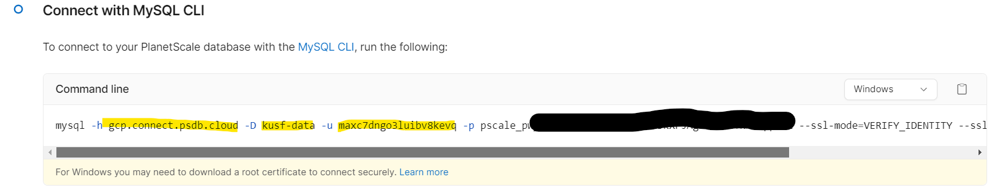
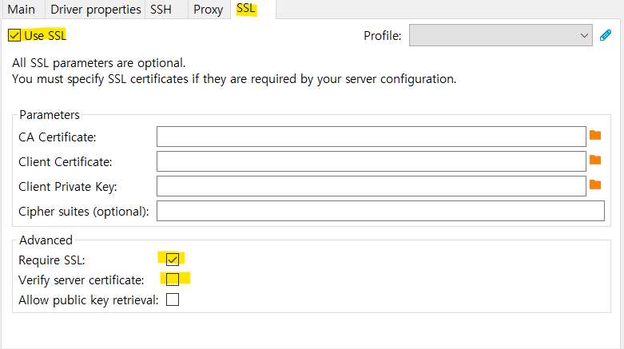
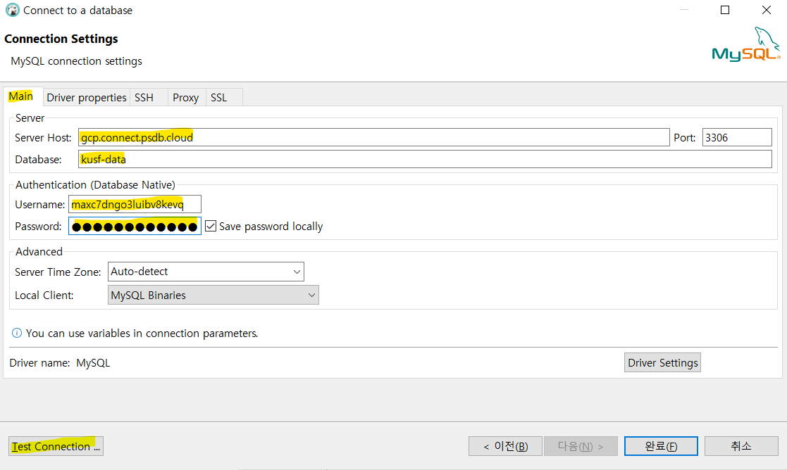
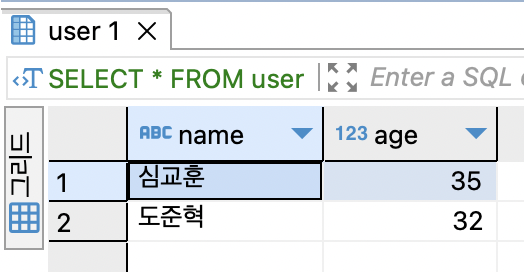

# 개발환경 세팅

> 수업 시간에 사용할 개발 도구들을 설치해보자.

## 비주얼 스튜디오 코드 (VSCODE)


VSCODE는 전세계에서 가장 많이 사용되는 통합 개발 환경이자 텍스트 에디터

- 텍스트 에디터: 텍스트 문서를 편집할 수 있는 프로그램. 프로그래밍 언어를 작성하는데 특화된 프로그램.
- 통합 개발 환경 (Integrated Development Environment, IDE): 프로그램 개발에 필요한 모든 작업을 하나의 프로그램 안에서 작업할 수 있는 환경을 제공하는 프로그램

### VSCODE 설치

- VSCODE 다운로드 링크: <https://code.visualstudio.com/download>

- 윈도우 사용자는 Windows 버튼, 맥북 사용자는 Mac 버튼 클릭

- homebrew로 맥북에 vscode 설치하는 방법: `brew install --cask visual-studio-code`
    - 참고: <https://bskyvision.com/entry/MacOS-brew%EB%A1%9C-%EB%A7%A5%EB%B6%81%EC%97%90-vscode-%EC%84%A4%EC%B9%98%ED%95%98%EA%B8%B0>

- 만약 맥북에 homebrew가 설치되어 있지 않다면?
    - homebrew: 맥북 패키지 관리 도구
    - 설치 명령: `/bin/bash -c "$(curl -fsSL https://raw.githubusercontent.com/Homebrew/install/HEAD/install.sh)"`

---

## 파이썬

- 현재 전세계에서 가장 인기있는 프로그래밍 언어 중 하나

- 파이썬이 인기 있는 이유
    - 비교적 쉬운 문법.
    - 인공지능, 데이터 분석, 웹 개발 등에 유용한 다양한 프레임워크 및 라이브러리 존재.

- TIOBE index: 프로그래밍 언어의 인기를 나타내는 지표. 구글, 빙, 야후 등의 검색 엔진에서 검색된 수치를 기반으로 하며, 전 세계에서 해당 언어를 사용하는 소프트웨어 엔지니어, 교육과정, 소프트웨어 개발업체 수도 순위 산정에 반영.
    - 참고: [ITworld](https://www.itworld.co.kr/numbers/82001/249502)

- 2023년 9월 기준 TIOBE Index
    - 1위: Python (14.16%)
    - 2위: C (11.27%)
    - 3위: C++ (10.65%)
    - 4위: Java (9.49%)
    - 5위: C# (7.31%)
    - 6위: JavaScript (3.30%)
    ...
    - 20위: Kotlin (0.90%)
    - 참고: [TIOBE](https://www.tiobe.com/tiobe-index/)

### 파이썬 설치

- 파이썬 다운로드 링크: <https://www.python.org/downloads/>

- 위 링크에서 각 운영체제에 해당하는 파이썬을 다운로드 받아서 설치.
    - PC에 이미 파이썬이 설치되어 있는 경우에는 이 단계 skip 해도 괜찮음.

- 파이썬 설치 방법 참고 자료: <https://wikidocs.net/193577>

- 윈도우 PC에서 설치할 때 "Add Python 3.xx to PATH" 체크박스 꼭 체크.

- homebrew로 맥북에 파이썬 설치: `brew install python`

---

## PlanetScale

> PlanetScale is the world’s most advanced MySQL platform.

- MySQL과 호환되는 서버리스 데이터베이스 플랫폼
    - 서버리스: 우리가 서버를 관리하고 유지보수할 필요가 없음.
    - 참고: <https://velog.io/@pjj186/planet>

- MySQL
    - 전 세계에서 가장 인기 있는 오픈소스 관계형 데이터베이스 관리 시스템 (relational database management system, RDBMS).
        - 유명한 RDBMS 예시. ex) MySQL, PostgreSQL, MariaDB, Microsoft SQL Server, Oracle Database 등
    - 행과 열로 구성된 테이블에 데이터를 저장.
    - SQL이라는 구조화된 쿼리 언어를 사용하여 데이터를 정의, 조작, 제어, 쿼리할 수 있음.
    - 참고
        - <https://cloud.google.com/mysql?hl=ko>
        - <https://cloud.google.com/learn/what-is-a-relational-database?hl=ko>

- MySQL 서버를 직접 설치하고 관리하려면 서버도 필요하고 인프라에 대한 많은 지식이 필요한데, PlanetScale과 같은 서버리스 플랫폼을 활용하면 별도의 설치 과정 없이 비교적 간단히 데이터베이스를 사용할 수 있음.

### PlanetScale 세팅

- PlanetScale 사이트: <https://planetscale.com/>

1. 깃허브 계정으로 로그인.

2. Create a new database 버튼 클릭.

3. 데이터베이스 이름 작명. ex) kusf-data

4. Region: `ap-northeast-1 (Tokyo)` 선택

5. Plan type: `Hobby` 선택
    - 무료니까.
    - Your Hobby database will be deployed to 1 availability zone. Each production branch includes 1 replica for high-availability.

6. 카드 등록 필요
    - 영문 주소변환 사이트: <https://www.jusoen.com/>
    - 등록만 할 뿐 돈 안 나가니 걱정마세요.

7. Create database 버튼 클릭

8. Select your language or framework: `MySQL CLI` 선택

9. 패스워드 이름 설정. ex) kusf-data

10. Username, Password 복사 및 메모장 등에 붙여넣기.
    - 한번만 보여주기 때문에 꼭 다른 곳에 남겨놔야 함.

11. Connect with MySQL CLI

    - 아래 명령 역시 메모장에 잘 복사해둘 것.

    

## DBeaver

> Free Universal Database tool.

- 내 PC에서 디비 접속 및 쿼리 실행을 간단히 할 수 있게 도와주는 프로그램.

- 많은 DB Client 프로그램 중에 현업에서 많이 사용되는 프로그램.

### DBeaver 설치

- 윈도우 PC에 DBeaver 설치: <https://bskyvision.com/entry/%EC%9C%88%EB%8F%84%EC%9A%B0-PC%EC%97%90-DBeaver-%EC%84%A4%EC%B9%98%ED%95%98%EA%B8%B0>

- Homebrew로 맥북에 DBeaver 설치: `brew install --cask dbeaver-community`
    - 참고: <https://bskyvision.com/entry/MacOS-%EB%A7%A5%EB%B6%81%EC%97%90-DBeaver-brew%EB%A1%9C-%EC%84%A4%EC%B9%98%ED%95%98%EA%B8%B0>

### DBeaver에서 PlanetScale DB 연결하기

- DBeaver 실행.

- 실행 후에 창 좌측 상단에 있는 콘센트 연결 아이콘을 클릭한다.

- 다음과 같은 항목들을 기입하여 PlanetScale에서 만든 DB에 연결을 맺는다.
    - SSL 탭
        - Use SSL 체크.
        - Require SSL 체크.
        - Verify server certificate 체크 해제.
        > SSL (Secure Sockets Layer)이란? 웹사이트와 브라우저 사이(또는 두 서버 사이)에 전송되는 데이터를 암호화하여 인터넷 연결을 보호하기 위한 표준 기술.

    

    - Main 탭
        - Server Host 기입
        - Database 기입. ex) kusf-data
        - Username 기입.
        - Password 기입.
        - Test Connection 버튼 클릭 후 연결 가능 여부 확인.

    

- 참고: <https://www.digicert.com/kr/what-is-ssl-tls-and-https>

- 잘 연결 되었다면 간단히 SQL의 맛만 봐보자.

- 테이블 하나 만들기
    - 테이블명: user

    ```SQL
    CREATE TABLE user (
        name varchar(20),
        age int
    );
    ```

- 유저 데이터 입력하기

    ```SQL
    INSERT INTO user VALUES ("심교훈", 35);
    INSERT INTO user VALUES ("도준혁", 32);
    ```

- 입력한 데이터 조회하기

    ```SQL
    SELECT * FROM user;
    ```

- 아래와 같은 화면이 나왔다면 성공적으로 테이블을 생성해서, 데이터를 입력하고, 조회한 것.

    
