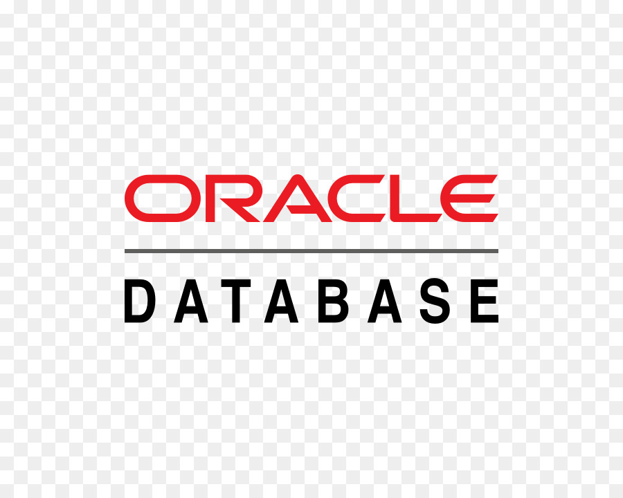

# 데이터베이스의 활용-데이터베이스란

> 데이터베이스란 무엇인가?

## 데이터베이스 (DB)

- 여러 사용자들이 공유하여 사용할 목적으로 체계화된 데이터 집합


참고 : 

- [KBO](https://www.koreabaseball.com/Record/Player/HitterBasic/Basic1.aspx)

- [MLB](https://baseballsavant.mlb.com/leaderboard/custom?year=2023&type=batter&filter=&sort=4&sortDir=desc&min=q&selections=xba,xslg,xwoba,xobp,xiso,exit_velocity_avg,launch_angle_avg,barrel_batted_rate,&chart=false&x=xba&y=xba&r=no&chartType=beeswarm)

## 데이터베이스 관리 시스템 - DBMS(Database Management System)

- 데이터베이스를 관리하는 소프트웨어

- 데이터를 저장, 검색, 수정, 삭제하는 데 사용되는 인터페이스 제공

- 사용 목적은 생산성 향상과 기능성, 신뢰성 확보

 |  | 
--- | --- | --- |

## SQL (Structured Query Language)

- DBMS에서 데이터를 검색, 추가, 수정, 삭제하는 데 사용되는 표준화된 프로그래밍 언어

- SQL명령은 보통 DML, DDL, DCL로 분류


## SQL 명령의 종류

- DDL (Data Definition Language)
  - 데이터베이스는 ‘데이터베이스 객체(object)’라는 데이터 그릇을 이용하여 데이터를 관리하는데, 이 같은 객체를 만들거나 삭제할 때 사용
  - e.g.) CREATE, DROP, ALTER 

- DML (Data Manipulation Language)
  - 데이터베이스에 새롭게 데이터를 추가하거나 삭제하거나 내용을 갱신하는 등, 데이터를 조작할 때 사용
  - 기본 명령어
  - e.g.) SELECT, INSERT, UPDATE, DELETE

- DCL (Data Control Language)
  - 트랜잭션을 제어하는 명령과 데이터 접근권한을 제어할 때 사용
  - e.g.) GRANT

- TCL (Transaction Control Language)
  - 논리적인 작업의 단위를 묶어서 DML에 의해 조작된 결과를 작업단위(트랜잭션) 별로 제어할 때 사용
  - e.g.) COMMIT, ROLLBACK

## 실습 준비

```sql
/*선수 테이블*/
CREATE TABLE player (
	seq INT NOT NULL,
	name VARCHAR(20),
	age INT,
	company VARCHAR(20),
	country VARCHAR(20),
	PRIMARY KEY(seq)
);
```
```sql
/*메시*/
INSERT INTO player
(seq, name, age, company, country)
VALUES(1, '메시', 37, '바르셀로나', '아르헨티나');
```
```sql
/*호날두*/
INSERT INTO player
(seq, name, age, company, country)
VALUES(2, '날강두', 39, '맨유', '포르투갈');
```
```sql
/*박수호*/
INSERT INTO player
(seq, name, age, company, country)
VALUES(3, '박수호', 29, '바르셀로나', '한국');
```
```sql
/*심교훈*/
INSERT INTO player
(seq, name, age, company, country)
VALUES(4, '심교훈', 36, '토트넘', '한국');
```
```sql
/*도준혁*/
INSERT INTO player
(seq, name, age, company, country)
VALUES(5, '도준혁', 33, null, '한국');
```