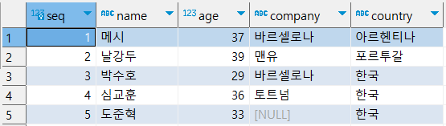

# 데이터베이스의 활용-SQL 기초

> 데이터와 친해지기

## SELECT
- 데이터 조회

```sql
SELECT * FROM player;
```


- 질의 또는 쿼리
- \* : Asterisk라고 부르며, 모든 열을 의미
- 컬럼 : seq, name, age, company, country을 각 각 부르는 말
- 행 : 가로로 한 줄을 의미
- 열 : 세로로 한 줄을 의미


### *Quiz1. SELECT*

> 1-1. player table에서 name 열만 출력

> 1-2. player table에서 name, age, country 열만 출력

## WHERE

### 조건절
- WHERE : 많은 행 속에서 필요한 데이터만 검색


### 비교 연산자
- 사용
  - = : 같을 경우
  - <> or != : 같지 않을 경우
  - \> : 좌변이 우변보다 클 경우
  - \>= : 좌변이 우변보다 크거나 같을 경우
  - < : 좌변이 우변보다 작을 경우
  - <= : 좌변이 우변보다 작거나 같을 경우


```sql
SELECT * FROM player WHERE country = '한국';
```


### 논리 연산자
- 사용
  - AND : 좌우의 식 모두 참일 경우
  - OR : 좌우의 식 둘 중 하나가 참일 경우


```sql
SELECT * FROM player WHERE name = '박수호' OR name = '심교훈' OR name = '도준혁';
```


```sql
SELECT * FROM player WHERE country = '한국' AND company = '토트넘';
```


### IN
```sql
/*결과 동일 (SELECT * FROM player WHERE name = '박수호' OR name = '심교훈' OR name = '도준혁';)*/
SELECT * FROM player WHERE name IN ('박수호', '심교훈', '도준혁');
```

### NULL
- NULL은 컬럼의 값을 모를 때 사용하는 표시로 값이 존재하지 않거나 값이 분명하지 않음을 나타냄
- NULL 값은 =, <>와 같은 비교 연산자를 통해 비교할 수 없음
- 사용
  - IS NULL : NULL인 경우
  - IS NOT NULL : NULL이 아닌경우
```sql
SELECT * FROM player WHERE company IS NULL;
```

### LIKE
- 사용
  - LIKE : 특정 문자나 문자열이 포함되어 있는지 검색하고 싶은 경우

```sql
SELECT * FROM player WHERE country LIKE '한%';
```


### *Quiz2. SELECT*

> 2-1. 나이가 30대 이고, 한국 사는 선수의 이름을 출력

> 2-2. 나이가 30대 이상인 선수 중에서, 소속이 없거나 포르투갈 국적을 가지지 않은 선수의 모든 정보를 출력

## INSERT
- 데이터 추가


```sql
INSERT INTO player (seq, name, age, company, country) 
VALUES (6, '홍길동', 20, '맨유', '한국');

/*모든 컬럼에 대한 값을 넣을때는 아래와 같이 컬럼정의는 생략 가능*/
/*
INSERT INTO player  
VALUES (6, '홍길동', 20, '맨유', '한국');
*/
```


- 컬럼 위치에 맞게 데이터를 넣어야 함

## UPDATE
- 데이터 수정

```sql
UPDATE player SET country = '미국' WHERE seq = 6;
```


## DELETE
- 데이터 삭제

```sql
DELETE FROM player WHERE seq = 6
```


```sql
/*전체 테이블 데이터 삭제 (주의)*/
/*
DELETE FROM player;
*/
```

### *Quiz3. INSERT, UPDATE, DELETE*

> 3-1. player 테이블에 조원들 정보를 INSERT

> 3-2. player 테이블에 본인의 이름을 별명으로 UPDATE (조심)

> 3-3. player 테이블에 조원들 정보와 본인의 정보를 DELETE (조심)