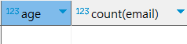

# 데이터베이스의 활용-SQL 기초

> 데이터와 친해지기

## 정렬
- 데이터를 원하는 순서로 정렬
- 사용
  - DESC : 내림차순 (Descendant)
    - 한글 : ㅎ-ㄱ
    - 영어 : z-a
    - 숫자 : 큰수 - 작은수
  - ASC : 오름차순 (Ascendant)
    - 한글 : ㄱ-ㅎ
    - 영어 : a-z
    - 숫자 : 작은수 - 큰수

```sql
SELECT * FROM player ORDER BY age DESC;
```


- 정렬에 중복 데이터가 있을 때, 다음 정렬 지정 가능

```sql
SELECT * FROM player ORDER BY country DESC, age ASC;
```


### Quiz 사전준비
```sql
CREATE TABLE student (
	email VARCHAR(100) NOT NULL,
	name VARCHAR(20) NOT NULL,
	age INT NOT NULL,
	school VARCHAR(20),
	birth DATE,
	PRIMARY KEY(email)
);
```
```sql
/*본인 포함하여 조원들 정보 데이터 추가 (총 4개의 데이터)*/
/*e.g.)*/
INSERT INTO student (email, name, age, school, birth)
VALUES ('oomoojoo@naver.com', '도준혁', 33, '동서대학교', '1991-05-29');
```

### *Quiz4. 정렬*

> 4-1. student 테이블에서 나이를 기준으로 내림차순으로 출력 (단, 같은 데이터가 있을 시, 이름을 기준으로 내림차순으로 한다.)


## 집계 함수
- 종류
  - COUNT
  - SUM
  - AVG
  - MIN
  - MAX


### COUNT
```sql
SELECT COUNT(*) FROM player;
```
- COUNT(\*) : '모든 열 = 테이블 전체'가 조회되는 갯수

```sql
SELECT COUNT(name) FROM player;
```
- 해당 열(name) 기준으로 조회되는 갯수

 | 
--- | --- | 

```sql
SELECT COUNT(company) FROM player;
```
- 집계 함수는 집합 안에 NULL 값이 있을 경우 무시


### SUM
```sql
SELECT SUM(age) FROM player;
```
- 문자나 날짜는 합계를 구할 수 없음
- 집계 함수는 집합 안에 NULL 값이 있을 경우 무시


#### 활용
```sql
SELECT SUM(age)/COUNT(age) FROM player;
```


### AVG
```sql
/*결과 동일 (SELECT SUM(age)/COUNT(age) FROM player;)*/
SELECT AVG(age) FROM player;
```


### MIN
```sql
SELECT MIN(age) FROM player;
```


### MAX
```sql
SELECT MAX(age) FROM player;
```


#### MIN / MAX
- 문자나 날짜에도 사용 가능

```sql
SELECT MIN(name), MAX(name) FROM player;
```


### *Quiz5. 집계함수*

> 5-1. student 테이블의 총 데이터 개수를 출력


> 5-2. student 테이블의 나이 합계, 평균 나이, 가장 많은 나이, 가장 적은 나이 출력


## GROUP BY

-  특정 컬럼을 그룹화

```sql
SELECT country, COUNT(country) 
FROM player
GROUP BY country
```


```sql
SELECT country, COUNT(country) 
FROM player
GROUP BY country
HAVING COUNT(country) = 1;

/*실행 불가*/
/*
SELECT country, COUNT(country)
FROM player
WHERE COUNT(country) = 1
GROUP BY country;
*/
```


- 내부처리 순서
  - FROM -> WHERE -> GROUP BY -> HAVING ->  SELECT -> ORDER BY
  
- GROUP BY에서 지정한 컬럼 이외의 컬럼은 집계함수를 사용하지 않은 채 SELECT 구에 지정하는 것은 권장하지 않음 (지정하지 않은 컬럼은 어떤 값으로 나와야 할지 알기 어렵기 때문)


### *Quiz6. 그룹화 - GROUP BY / HAVING*

> 6-1. student 테이블에서 나이별 학생 수를 출력 (출력 : 나이, 학생 수)


> 6-1-1. 출력된 데이터 중 동갑이 있는 데이터(나이별 학생 수가 2이상)들만 출력 (출력 : 나이, 학생 수)



> 6-2. student 테이블에서 나이가 23세 이상인 학생들 중 학교별 학생 수를 출력하라. (출력 : 학교, 학생 수)


## 서브쿼리

- 서브쿼리는 SELECT 명령에 의한 데이터 질의로, 상부가 아닌 하부의 부수적인 질의를 의미
  - SELECT문 안에 SELECT문을 의미
  - 사용
    - (SELECT 명령)

```sql
SELECT * 
FROM player
WHERE age = (SELECT MIN(age) FROM player);
```


### *Quiz7. 서브쿼리*

> 7-1. student 테이블에서 평균나이보다 많은 학생들을 출력 (출력 : 모든 컬럼)

