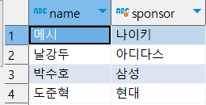
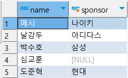
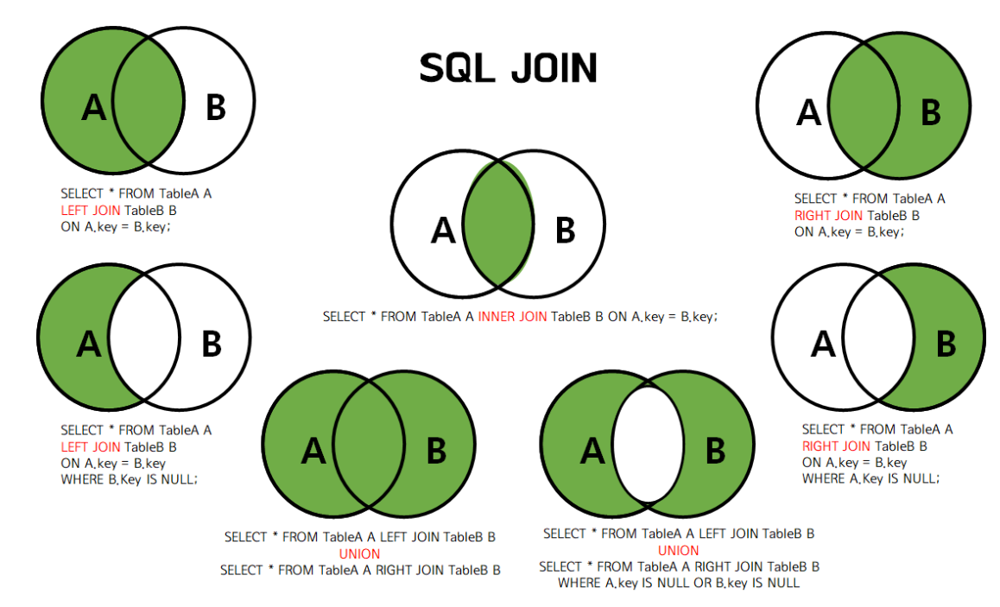

# 데이터베이스의 활용-SQL 심화

> 데이터를 원하는대로

## 별칭 (Alias)
- 테이블과 컬럼(열)에 별칭 지정 가능
```sql
SELECT * FROM player AS p;

SELECT p.name FROM player AS p;

SELECT name AS nm FROM player;

SELECT p.name AS nm FROM player AS p;
```
> AS는 생략이 가능하나, 처음에는 붙이는 걸 권장

## 자주 사용하는 함수
- MySQL 함수 종류
  - https://www.w3schools.com/mysql/mysql_ref_functions.asp
```sql
/* 대문자를 소문자로 변환 */
SELECT LOWER('HELLO') FROM DUAL;

/* 소문자를 대문자로 변환 */
SELECT UPPER('hello') FROM DUAL;

/* 두개의 문자열을 연결 */
SELECT CONCAT('hello', 'world') FROM DUAL;

/* 1번째 자리에서 5번째 자리까지 문자열 */
SELECT SUBSTR('helloworld', 1, 5) FROM DUAL;

/* 6번째부터 모든 문자열*/
SELECT SUBSTR('helloworld', 6) FROM DUAL;

/* 문자열의 길이 */
SELECT LENGTH('hello') FROM DUAL;

/* 문자열 10자리까지 부족한 문자는 왼쪽에 *로 채우기 */
SELECT LPAD('hello', 10, '*') FROM DUAL;

/* 문자열 10자리까지 부족한 문자는 오른쪽에 *로 채우기 */
SELECT RPAD('hello', 10, '*') FROM DUAL;

/* 양쪽 공백 제거 */
SELECT TRIM('  hello  ') FROM DUAL;

/* o문자를 찾아서 *로 변경 */
SELECT REPLACE('helloworld', 'o', '*') FROM DUAL;

/* null이면 hello로 출력 */
SELECT IFNULL(null, 'hello') FROM DUAL;

/* 절대값 */
SELECT ABS(-5) FROM DUAL;

/* 첫번째(1)자리까지 반올림*/
SELECT ROUND(5.55, 1) FROM DUAL;

/* 케이스별로 원하는 값을 value컬럼으로 가져오기 */
SELECT 
	CASE WHEN 1!=1 THEN 'A'
	WHEN 2=2 THEN 'B'
	END AS 'value'
FROM DUAL;

/* 현재 날짜와 시간(NOW())을 원하는 포맷으로 출력*/
SELECT DATE_FORMAT(NOW(), '%Y-%m-%d %h:%i:%s') FROM DUAL;
```
> 날짜/시간 포맷 : https://www.w3schools.com/mysql/func_mysql_date_format.asp


## 테이블
  
### 테이블 작성
  - 열명 자료형 [DEFAULT 기본값] [NULL or NOT NULL]
    - DEFAULT값이 필요 없다면, 생략 가능
    - NULL을 허용 한다면, 생략 가능

```sql
CREATE TABLE 테이블명 (
  열정의1,
  열정의2,
  .
  .
  열정의10
)
```
- 자료형
  - VARCHAR : 문자
  - INT : 정수
  - DECIMAL : 실수
  - DATE : 날짜
  - DATETIME : 날짜/시간
> FLOAT vs DOUBLE vs DECIMAL
> - FLOAT는 4byte의 값 범위, DOUBLE은 8byte의 값 범위
> - FLOAT와 DOUBLE은 부동소수점, DECIMAL은 고정소수점
> - FLOAT와 DOUBLE보다 정밀하게 값을 다뤄야하는 경우에 DECIMAL 사용 (e.g. 이자율, 차량할인 등)


> 더 많은 자료형 : https://interconnection.tistory.com/100

```sql
-- 자료형 예시
CREATE TABLE data_type (
  col_varchar VARCHAR(100),
  col_int INT(11),
  col_decimal DECIMAL(10, 2),
  col_date DATE,
  col_datetime DATETIME
);

INSERT INTO data_type (col_varchar, col_int, col_decimal, col_date, col_datetime)
VALUES('문자열', 1, 11.11, NOW(), NOW());
```
```sql
-- 테이블 작성 예시
CREATE TABLE student (
  email VARCHAR(100) NOT NULL,
  name VARCHAR(20) NOT NULL,
  age INT NOT NULL,
  school VARCHAR(20),
  birth DATE,
  PRIMARY KEY(email)
);
```

### 테이블 삭제
```sql
DROP TABLE 테이블명;
```

### 테이블 모든 행 삭제
```sql
TRUNCATE TABLE 테이블명;
```
> DELETE VS TRUNCATE
> - DELETE는 내부적으로 한줄 한줄 일일히 제거
>   - DELETE는 원하는 데이터를 골라서 삭제할 때 사용
> - TRUNCATE는 전체 데이터를 한번에 제거

### 테이블 변경

#### 테이블 열 추가
```sql
ALTER TABLE 테이블명 ADD 열이름 정의;
```
```sql
-- e.g.)
ALTER TABLE student ADD major VARCHAR(20);
ALTER TABLE student ADD major VARCHAR(20) DEFAULT '컴퓨터공학' NOT NULL;
```

#### 테이블 열 속성 변경
```sql
ALTER TABLE 테이블명 MODIFY 열이름 정의;
```
```sql
-- e.g.)
ALTER TABLE student MODIFY major VARCHAR(40);
ALTER TABLE student MODIFY major VARCHAR(40) DEFAULT
'영어학과';
```

#### 테이블 열 이름 변경
```sql
ALTER TABLE 테이블명 CHANGE 기존열이름 새로운열이름정의;
```

```sql
ALTER TABLE student CHANGE major new_major VARCHAR(40);
```

#### 테이블 열 삭제
```sql
ALTER TABLE 테이블명 DROP 삭제할 열;
```
```sql
ALTER TABLE student DROP new_major;
```


### 키(Key)
```sql
CREATE TABLE student (
  email VARCHAR(20) NOT NULL,
  ...
  ...
  PRIMARY KEY(email)
);
```

#### 기본키
- 테이블에 저장된 행을 식별할 수 있는 유일한 값
- 값의 중복이 없어야 함
- NULL 값을 가질 수 없음

#### 외래키
- 테이블간의 관계를 나타낼 때 사용
- 다른 테이블의 기본키를 참조해 외래키로 지정
  - 즉, 한 테이블의 외래키는 연결되어 있는 다른 테이블의 기본키 중 하나

> 다른 키 종류
>  - https://velog.io/@kon6443/DB-%EA%B8%B0%EB%B3%B8%ED%82%A4-%EC%99%B8%EB%9E%98%ED%82%A4-%ED%9B%84%EB%B3%B4%ED%82%A4-%EB%B3%B5%ED%95%A9%ED%82%A4-%EA%B0%9C%EB%85%90-4x1bgz5w
>  - https://ddecode.tistory.com/entry/%EB%8D%B0%EC%9D%B4%ED%84%B0%EB%B2%A0%EC%9D%B4%EC%8A%A4DB-4%EA%B4%80%EA%B3%84%ED%98%95-%EB%8D%B0%EC%9D%B4%ED%84%B0%EB%B2%A0%EC%9D%B4%EC%8A%A4%EC%9D%98-%ED%82%A4key%EC%9D%98-%EC%A2%85%EB%A5%98

### 테이블 합집합

#### UNION ALL - 합집합 (중복 O)
```sql
SELECT name FROM student
UNION ALL
SELECT name FROM player;
```
```sql
SELECT name FROM student
UNION
SELECT name FROM player;
```

### 테이블 결합
```sql
-- 사전준비
CREATE TABLE sponsor (
  id VARCHAR(20) NOT NULL,
  name VARCHAR(20) NOT NULL,
  PRIMARY KEY(id)
);

INSERT INTO sponsor (id, name) VALUES ('01', '나이키');

INSERT INTO sponsor (id, name) VALUES ('02', '아디다스');

INSERT INTO sponsor (id, name) VALUES ('03', '삼성');

INSERT INTO sponsor (id, name) VALUES ('04', '현대');
```

```sql
-- 사전준비
ALTER TABLE player ADD sponsor VARCHAR(20);

/*메시*/
UPDATE player SET sponsor = '01' WHERE seq = 1;
/*날강두*/
UPDATE player SET sponsor = '02' WHERE seq = 2;
/*박수호*/
UPDATE player SET sponsor = '03' WHERE seq = 3;
/*심교훈*/
UPDATE player SET sponsor = '05' WHERE seq = 4;
/*도준혁*/
UPDATE player SET sponsor = '04' WHERE seq = 5;
```

### INNER JOIN
- 데이터의 교집합
  -  즉, 서로 존재하는 데이터들만 조회

```sql
SELECT
  p.name, 
  s.name AS sponsor
FROM player AS p
INNER JOIN sponsor AS s
  ON p.sponsor = s.id;
```


### LEFT OUTER JOIN
- 왼쪽 테이블의 기준으로 데이터를 다 가져오고, 오른쪽 테이블 데이터가 없는 경우는 NULL로 조회

```sql
SELECT
  p.name, 
  s.name AS sponsor
FROM player AS p
LEFT OUTER JOIN sponsor AS s
ON p.sponsor = s.id;
```


### RIGHT OUTER JOIN
- 오른쪽 테이블의 기준으로 데이터를 다 가져오고, 왼쪽 테이블 데이터가 없는 경우는 NULL로 조회

```sql
SELECT
  p.name, 
  s.name AS sponsor
FROM player AS p
RIGHT OUTER JOIN sponsor AS s
ON p.sponsor = s.id;
```


### 명시적 조인 vs 암시적 조인
```sql
-- 명시적 조인
SELECT
  p.name, 
  s.name AS sponsor
FROM player AS p
INNER JOIN sponsor AS s
  ON p.sponsor = s.id;
```
```sql
-- 암시적 조인
SELECT
  p.name, 
  s.name AS sponsor
FROM player AS p, sponsor AS s
WHERE p.sponsor = s.id;
```
> 명시적 조인 vs 암시적 조인
> - JOIN절을 위한 조건절과 조회 조건을 위한 조건절의 구분이 어려움으로, 가능하다면 유지보수성을 위해 명시적 조인을 사용하는 것을 권장

### 한눈에 이해하기
