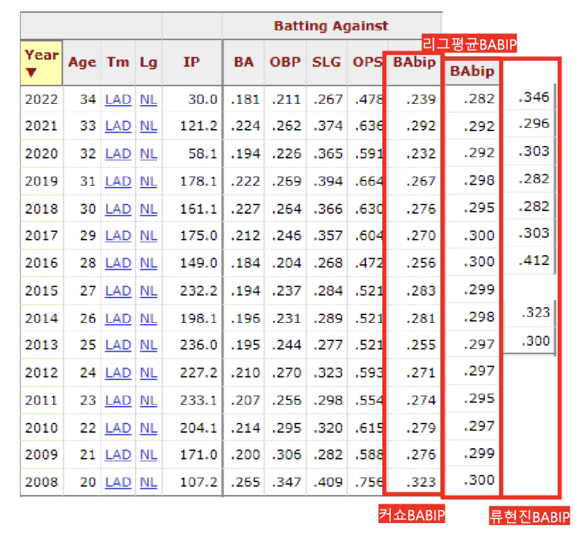
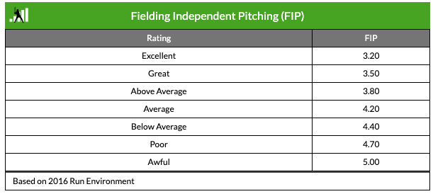
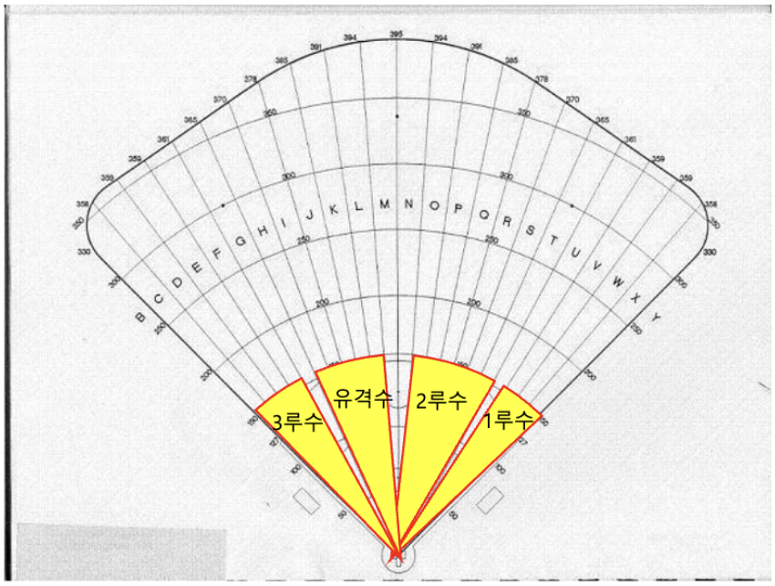

# 데이터베이스의 활용-야구 스탯

스탯 (stat): statistics 통계의 약자. 통계적인 수치로 나타낸 선수의 능력치.

스탯 (stat) = 지표 (indicator) = 지수 (index)

* 클래식 스탯: 타율, 홈런, 득점, 타점, 도루, 다승, 평균자책점, 출루율, 장타율 등

* 세이버 스탯: OPS, RC, BABIP, wOBA, wRC+, FIP, DRS, WAR, WHIP, WPA 등

## 타격 스탯

### 주요 스탯 공식

- 타율 (batting average, BA 또는 AVG)

  ```
  타율 = 안타 / 타수
      = 안타 / (타석 - 볼넷 - 사구 - 희생번트 - 희생플라이 - 타격방해 - 주루방해)
  ```

  타수: 타자가 타석에게 타격을 완료한 횟수

- 출루율 (on base percentage, OBP)

  ```
  출루율 = (안타 + 볼넷 + 사구) / (타수 + 볼넷 + 사구 + 희생플라이)
      = (안타 + 볼넷 + 사구) / (타석 - 희생번트 - 타격방해)
  ```

- 장타율 (slugging percentage, SLG)

  ```
  장타율 = (1루타 + 2*2루타 + 3*3루타 + 4*홈런)/타수
  ```

- 순장타율 (isolated power, IsoP): 단타를 제거함으로 순수한 장타 능력을 알아보기 위한 스탯

  ```
  순장타율 = 장타율 - 타율
      = (1루타 + 2*2루타 + 3*3루타 + 4*홈런)/타수 - (1루타 + 2루타 + 3루타 + 홈런)/타수
      = (2루타 + 2*3루타 + 3*3루타)/타수
  ```

- 장타율의 한계: 장타없이 단타를 많이 쳐도 높게 나올 수 있음

  10타수 8안타를 기록한 선수 A의 장타율 = 8/10 = 0.8 = 8할
  
  10타수 2홈런을 기록한 선수 B의 장타율 = (4*2)/10 = 0.8 = 8할

  반면, 순장타율은?

  선수 A의 순장타율 = 0/10 = 0
  
  선수 B의 순장타율 = (3*2)/10 = 0.6 = 6할

  - 관련 예시: 2021년 이정후, 강백호, 박동원, 박병호 장타율, 순장타율 비교 (KBO 기록실)
    - 이정후: 장타율 4위 / 순장타율 21위
    - 강백호: 장타율 5위 / 순장타율 18위
    - 박동원: 장타율 16위 / 순장타율 10위
    - 박병호: 장타율 26위 / 순장타율 12위
    - 이정후 선수(타율 1위 0.360), 강백호 선수(타율 3위 0.347)는 타율이 높았기 때문에 장타율 순위에서 높은 위치에 있었던 것

- OPS (on-base plus slugging)

  ```
  OPS = 장타율 + 출루율
  ```

  출루율의 값의 범위는 0~1이고 장타율의 값의 범위는 0~4이기 때문에 OPS는 값의 범위가 다른 것을 더한 꼴.

  따라서, 장타율이 높은 타자가 OPS에 있어서 무조건 유리.

  ```
  Quiz 9. 좋아하는 KBO 선수의 2023년 타율, 출루율, 장타율, 순장타율을 직접 구해보자. 
  파이썬 코딩 활용하기. 
  변수 활용.
  ```

- GPA (gross production average 또는 Gleeman production average)

  ```
  GPA = (1.8*출루율 + 장타율) / 4
  ```

  Aaron Gleeman이라는 사람이 만든 스탯.
  
  출루율이 장타율보다 80%만큼 더 중요하다는 연구 결과를 기초로 출루율에 1.8을 곱해줌.
  
  타율과 비슷한 값의 범위가 되게 하기 위해서 4로 나눠줌.

- RC (run created, 득정 생산 또는 득점 창출력)

  야구는 기본적으로 득점을 많이 해야 승리하는 종목
  
  한 선수가 득점 생산에 얼마나 큰 기여를 했는지를 나타내고자 한 스탯
  
  빌 제임스가 개발
  
  <기본 컨셉>

  ```
  RC = (A * B) / C
  ```

  여기서 A는 출루 능력, B는 진루 능력, C는 주어진 기회.

  <2002년 버전 RC 공식>

  ```
  A = 안타 + 볼넷 + 사구 - 도루실패 - 땅볼병살타

  B = 1.125*1루타 + 1.69*2루타 + 3.02*3루타 + 3.73*홈런 + 0.29*(볼넷 - 고의4구 + 사구) + 0.492*(희생번트 + 희생플라이 + 도루) - 0.04*삼진

  C = 타수 + 볼넷 + 사구 + 희생번트 + 희생플라이

  RC = (2.4C + A)(3C + B) / 9C - 0.9C
  ```

- RC27

  1번부터 9번까지 같은 타자로 팀을 채웠을 경우, 27개의 아웃카운트를 잡아 경기가 끝날 때까지 그 팀이 총 몇 점을 득점할 수 있는지를 나타낸 지표.

  ```
  RC27 = RC / (타수 - 안타 + 도루실패 + 희생번트 + 희생플라이 + 땅볼병살타) * 27
  ```
  
  RC27도 RC와 마찬가지로 다양한 공식이 존재.

  ```
  Quiz 10. 2023년 타격왕 손아섭 9명 vs 홈런왕 노시환 9명 누가 더 강한 팀일까?

  파이썬 코딩을 활용하여 두 선수의 RC27을 구해보자. 
  ```

- XR (extrapolated runs, 추정득점)

  짐 퍼테이도가 개발.

  RC와 목적성은 거의 같음. 실제로 득점에 얼마나 기여했는지 추정.

  ```
  XR = 0.5*1루타 + 0.72*2루타 + 1.04*3루타 + 1.44*홈런 + 0.38*(사구 + 볼넷 - 고의4구) + 0.25*고의사구 + 0.18*도루 - 0.32*도루실패 - 0.09*(타수 - 안타 - 삼진) - 0.098*삼진 - 0.37*병살타 + 0.37*희생플라이 + 0.04*희생번트
  ```

  (타수 - 안타 - 삼진): 범타를 의미

  팀 선수들의 XR을 모두 더하면 실제 팀 득점과 거의 같다.

- 가중출루율 (weighted on-base average, wOBA)

  <팬그래프 2013 버전>
  
  ```
  wOBA = (0.69*고의4구제외한볼넷 + 0.72*사구 + 0.89*1루타 + 1.27*2루타 + 1.62*3루타 + 2.10*홈런) / (타수 + 고의4구제외한볼넷 + 희생플라이 + 사구)
  ```

  <스탯티즈 2022 버전>
  ```
  wOBA = (0.72*고의4구제외한볼넷 + 0.75*사구 + 0.9*1루타 + 0.92*실책출루 + 1.24*2루타 + 1.56*3루타 + 1.95*홈런) / (타석 - 고의4구)
  ```

  톰 탱고 개발.

  가중치를 나타내는 계수는 시즌마다 득점 환경에 따라 바뀜.

- 가중득점창출력 (weighted runs created, wRC+)

  구장별 조정(park factor)을 거친 형태의 wOBA

  파크팩터: 투수의 무덤 콜로라도를 홈구장으로 쓰는 타자가 다른 구장을 홈으로 쓰는 타자보다 유리. 구장에 의한 영향을 최소화하기 위해 기록을 조정할 필요가 있음.

---

## 투구 스탯

### 주요 스탯 공식

- 평균자책점 (earned run average, ERA)

  ```
  ERA = (9*자책점)/이닝
  ```

  투수의 9이닝당 자책점

- BABIP (batting average on balls in play)

  ```
  BABIP = (안타 - 홈런) / (타수 - 삼진 - 홈런 + 희생플라이)
  ```

  인플레이 타구에 대한 타율

  보로스 맥크라켄 1999년 발표

  투수 기량에서 수비와 운 요소를 분리하려는 시도

  > 브로스 맥브라켄: "인플레이 타구가 안타가 되게 할 확률은 투수(또는 타자)의 실력이 아니라 운과 수비력에 크게 영향을 받는다"

  인플레이 타구가 안타가 될 확률은 어떤 투수가 던지든 비슷하다는 것이 맥크라켄의 주장. 하지만 리그 평균보다 꾸준히 낮은 BABIP을 보여주는 투수가 있다면 그것은 실력.

  

  클레이턴 커쇼는 안타 억제력이 좋은 투수라고 볼 수 있음.

- 수비 무관 투구 (fielding independent pitching, FIP)

  톰 탱고가 개발.

  수비와 운, 전후 관계를 제외한 채 투수의 기량을 평가하는 것이 목적.

  인플레이 타구가 안타될 확률은 투수가 관여할 수 있는 것이 아니니 그것들을 제외하고 평가해보자는 취지.

  ```
  FIP = (13*홈런 + 3*볼넷 + 3*사구 -2*삼진)/이닝 + cFIP
  ```

  여기서 `cFIP = 리그ERA - (13*리그홈런 + 3*리그볼넷 + 3*리그사구 - 2*삼진) / 리그이닝`

  * 시즌별 cFIP 참고 링크: <https://www.fangraphs.com/guts.aspx?type=cn>

  홈런, 볼넷, 사구를 많이 허용하면 FIP가 높아지고, 탈삼진을 많이 잡아내면 FIP가 낮아짐.

  

  ```
  Quiz 11. 좋아하는 KBO 투수의 2022년 시즌 FIP를 직접 계산해보자!
  
  1. cFIP를 먼저 구한다.
    - 리그 이닝: KBO 기록실 팀기록/투수에서 전체 팀 이닝의 합계
    - 리그 자책점: KBO 기록실 팀기록/투수에서 전체 팀 자책점의 합계
    - 리그 ERA: (9*리그자책점) / 리그이닝
    - 리그홈런: KBO 기록실 팀기록/투수에서 전체 팀 피홈런의 합계
    - 리그볼넷: KBO 기록실 팀기록/투수에서 전체 팀 볼넷의 합계
    - 리그사구: KBO 기록실 팀기록/투수에서 전체 팀 사구의 합계
    - 리그삼진: KBO 기록실 팀기록/투수에서 전체 팀 탈삼진의 합계
  
  2. FIP를 계산한다.

  3. 계산한 결과를 스탯티즈의 FIP와 비교해본다.
    - 스탯티즈 버전 FIP = (13*피홈런 + 3*(볼넷-고의4구+사구) - 2*삼진)/이닝 + C
    - 스탯티즈에서는 고의4구를 볼넷에서 제외하기 때문에 우리가 구한 것과 약간의 차이가 날 수 있음. 
  ```

- WHIP (walks plus hits divided by innings pitched, 이닝당 안타 및 볼넷 허용률)

  일단 출루를 적게 허용해야 결국 실점을 적게 할 가능성이 높아진다는 점에 주안점을 둠.

  ```
  WHIP = (안타 + 볼넷)/이닝
  ```

  |FIP 평가기준||
  |---|---|
  |1 미만|리그 에이스|
  |1.2 미만|팀 에이스|

---

## 수비 스탯

### 주요 스탯 공식

- 수비율 (fielding percentage, FTCP)

  ```
  수비율 = (보살 + 자살)/(보살 + 자살 + 실책)
  ```

- 레인지팩터 (range factor, RF)

  ```
  RF = 9*(자살 + 보살) / 수비이닝
  ```

  빌 제임스가 만든 스탯.

  수비 범위가 넓은 선수는 수비 이닝에 비해 자살과 보살을 기록하는 횟수가 수비 범위가 좁은 선수에 비해서 많을 것이다.

  외야수 중에 중견수가 우익수, 좌익수에 비해 일반적으로 수비범위가 넓기 때문에 RF도 높은 편.

- 존 레이팅 (zone, rating, ZR)

  1980년대에 존 듀언 개발.
  
  야수별로 책임져야 할 구역을 정하고, 각 구역에 들어간 타구를 해당 야수가 아웃으로 연결한 비율.

  ```
  ZR = (자기 구역에서 아웃 처리한 공) / (자기 구역에 떨어진 공)
  ```

  내야수는 땅볼에만 책임.

  외야수는 라인드라이브와 플라이볼에 대해서 책임.

  필드를 A~Z로 분할.

  파울 구역인 A, B, Y, Z를 제외하고 포지션별로 책임져야할 구역이 있음.

  

  |포지션|책임구역|
  |---|---|
  |1루수|V, W, X 땅볼|
  |2루수|O, P, Q, R, S, T 땅볼|
  |유격수|H, I, J, K, L 땅볼|
  |3루수|C, D, E, F 땅볼|
  |좌익수|E, F, G, H, I 라인드라이브 (280~340피트), D, E, F, G, H, I 뜬공 (200피트 이상)|
  |중견수|K, L, M, N, O, P 라인드라이브 (300~370피트), J, K, L, M, N, O, P, Q 뜬공 (200피트 이상)|
  |우익수|R, S, T, U, V 라인드라이브 (280~340피트), R, S, T, U, V, W 뜬공 (200피트 이상)|

  Q. 만약 수비 시프트가 걸려 있어서 다룬 구역에서 아웃을 처리하면? 자기 구역에서 처리한 것으로 인정해줌.

- 얼티밋 존 레이팅 (ultimate zone rating, UZR)

  미첼 리쿠토먼이 ZR을 보완/발전시켜서 만든 스탯.

  수비에 득점 가치를 부여해서 얼마나 많은 점수를 막아냈는지 평가.

  78개 구역으로 분할, 64개 구역만 계산에 반영.

  어느 구역에 떨어진 공을 아웃시켰는가에 따라 가치를 다르게 부여한다는 점이 ZR과의 가장 큰 차이.

  ex) 담장을 넘어갈 뻔한 타구를 아웃시킴의 가치 >> 평범한 중견수 뜬공을 아웃시킴의 가치.

  ```
  UZR = (외야수가 평균수준의 외야수에 비해 추가 진루를 막음으로써 세이브한 점수의 총합) + (내야수가 평균수준의 내야수에 비해 병살플레이를 통해 세이브한 점수의 총합) + (평균수준의 야수에 비해 수비 범위가 넓은지 좁은지 평가 점수) + (평균수준의 야수에 비해 에러가 많은지 적은지 평가 점수)
  ```

  UZR/150 = UZR을 150경기로 환산한 값.

- DRS (defensive run saved)

  UZR보다 구역을 더 세세하게 분할.

  같은 포지션의 평균수준의 선수와 비교했을 때 얼마나 많은 점수를 막아냈는지 정량화

  6가지 요소로 야수의 수비능력 평가

  1. 투수, 포수 - 도루 저지 능력
  2. 1루수, 3루수 - 번트 타구 처리 능력
  3. 2루수, 유격수 - 더블플레이 처리 능력
  4. 외야수 - 추가 진루 저지 능력
  5. 외야수 - 홈런 타구 포구 능력
  6. 전체 야수 - 수비 범위와 타구를 아웃으로 바꾸는 능력
