# 데이터베이스의 활용-레먼데이터베이스

> MLB 데이터를 가지고 놀면서 SQL 문법을 익혀보자

## 레먼데이터베이스 소개

- 숀 레먼이 만든 MLB 데이터베이스
- 1871년부터 2022년까지의 MLB 데이터 보유 (타격, 투구, 수비 등)
- 매 시즌 종료 후 갱신
- 웹사이트: <http://seanlahman.com/download-baseball-database/>
- 우리는 이 수업에서 2019 시즌 데이터까지 쌓아둔 SQL Lite 버전의 데이터를 사용할 것.

---

## sqlite 파일 다운로드 및 DBeaver 연결

- 2019 - SQL Lite 링크 클릭해서 lahmansbaseballdb.sqlite 파일 다운로드

  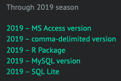

- 다운로드 받은 파일은 이후 작업을 위해 바탕화면에 kusf-mlb라는 폴더를 하나 만든 후 거기에 넣는다.

- DBeaver를 실행한 후 새로운 연결을 하나 생성한다.

- Select your database 창에서 SQLite를 선택한다.

  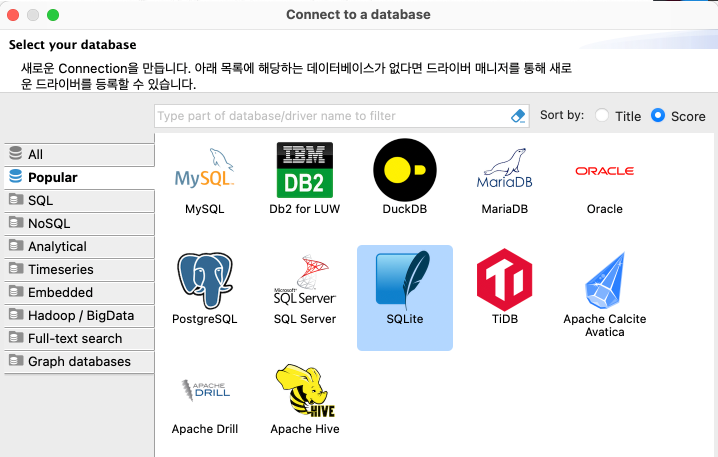

- Path 선택 시 바탕화면에 있는 kusf-mlb 폴더 내 lahmansbaseballdb.sqlite 파일을 선택한다.

- Test Connection 버튼을 클릭한다.

- SQLite driver file을 다운로드 받으라고 할 것이다. 다운로드 버튼을 클릭하여 다운로드 받는다.

  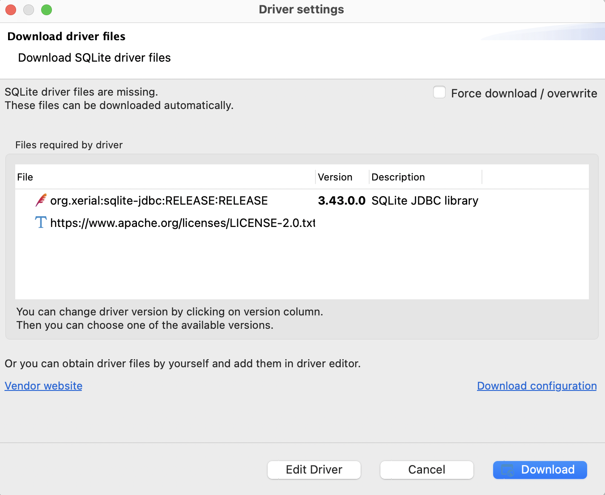

- Finish 버튼을 클릭하여 데이터베이스에 연결한다.

- SQL 편집기를 열고 잘 설치되었는지 확인하기 위해 아래 쿼리를 작성한 후 실행해본다.

  ```sql
  SELECT * FROM batting LIMIT 10;
  ```

  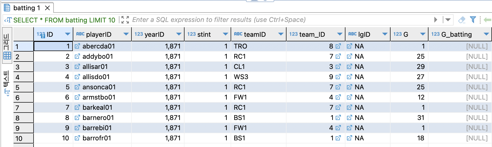

---

## 테이블 소개

- 주요 테이블

  1. People: 선수 정보

  2. Batting: 타격 데이터

  3. Pitching: 투구 데이터

  4. Fielding: 수비 데이터

- 그 외 테이블

  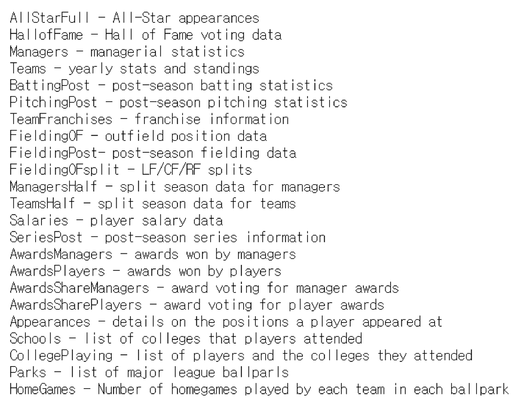

- 테이블 명세

  1. Batting
    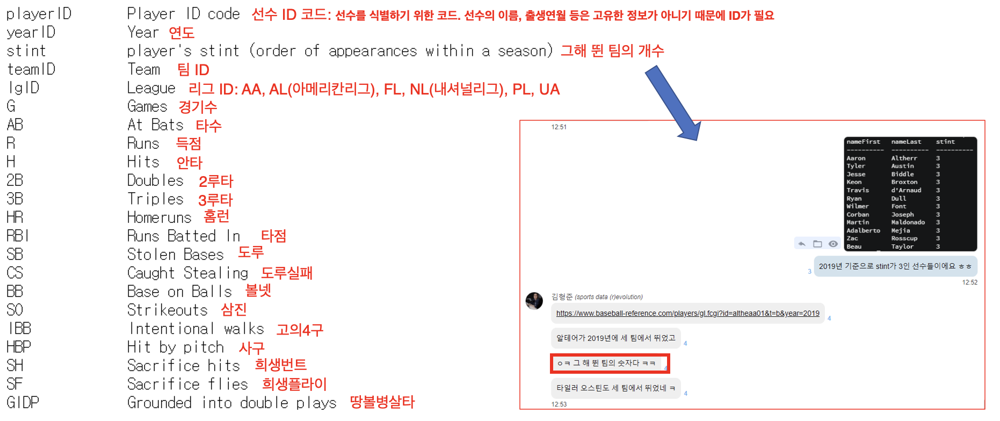

  2. Pitching
    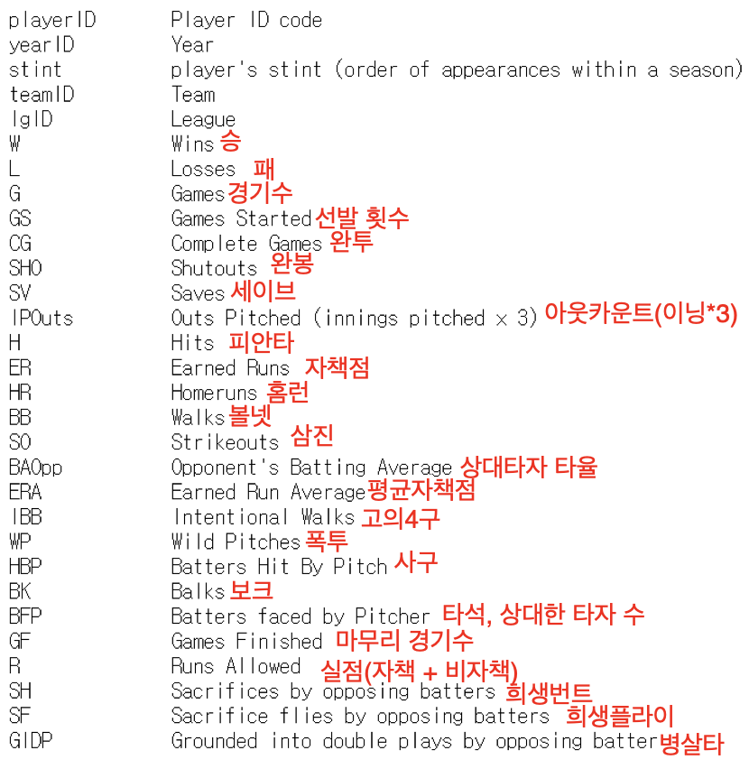

  3. Fielding
    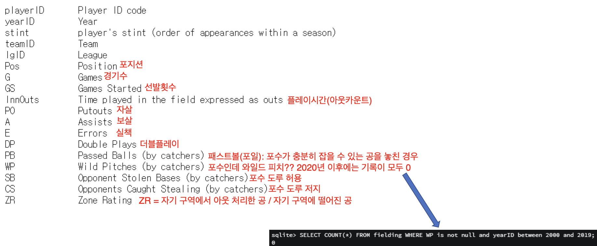

---

## 레먼데이터베이스로 MLB 데이터 조회하기

### MLB 역대 한국 선수들 조회하기(데뷔순으로 조회)

```sql
SELECT
  *
FROM people
WHERE birthCountry = 'South Korea'
ORDER BY debut;
```

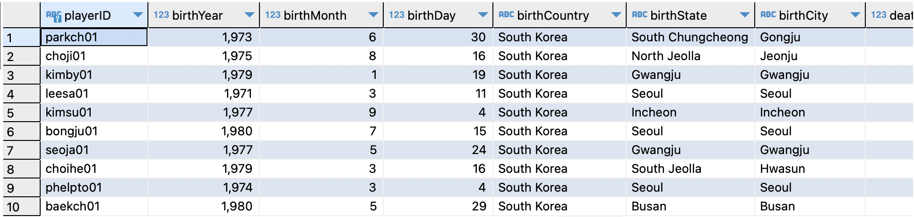

총 몇 명인지 세려면?

```sql
SELECT
  COUNT(*)
FROM people
WHERE birthCountry = 'South Korea';  -- 23
```

```
Quiz 12. MLB 선수를 5명 이상 배출한 나라 목록과 선수 수 조회

아래와 같은 결과가 조회되게 하는 SQL문을 작성하시오.
```

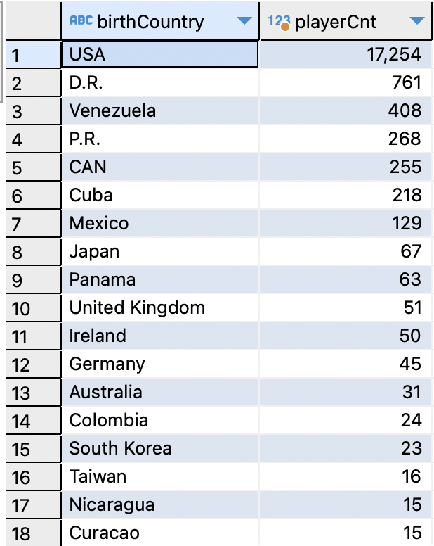

### 2016년 MLB 연봉 TOP 10 확인하기

```sql
SELECT
  * 
FROM salaries 
WHERE yearID = 2016
ORDER BY salary DESC
LIMIT 10;
```

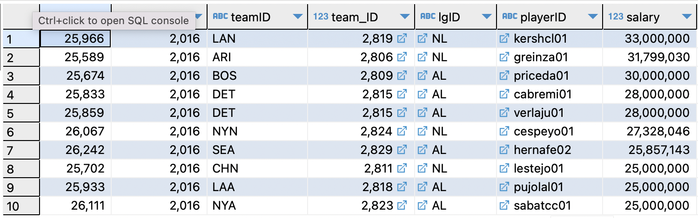

playerID (kershcl01)로 어떤 선수인지 확인하기

```sql
SELECT
  nameFirst, nameLast, birthCountry, birthYear, birthMonth, birthDay
FROM people
WHERE playerID = 'kershcl01'; 
```

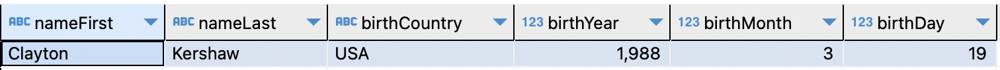

JOIN을 활용하여 2016년 연봉 TOP 10 한번에 이름까지 조회하기

```sql
SELECT
  s.teamID, s.salary, p.nameFirst, p.nameLast
FROM salaries AS s
LEFT OUTER JOIN people AS p
ON s.playerID = p.playerID
WHERE s.yearID = 2016
ORDER BY s.salary DESC
LIMIT 10;
```

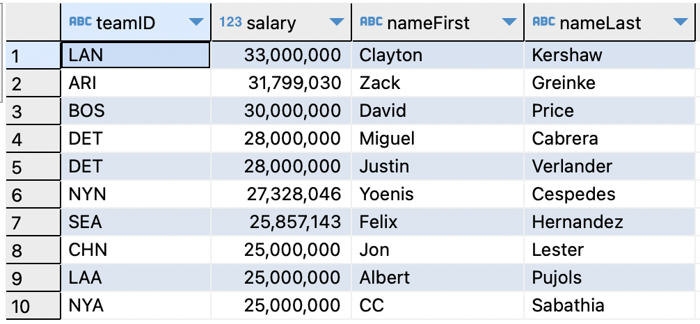

### 야디어 몰리나(Yadier Molina)의 매 시즌 도루저지율 조회

몰리나의 playerID 확인하기

```sql
SELECT
  playerID, nameFirst, nameLast
FROM people 
WHERE nameLast = 'Molina' 
  AND nameFirst = 'Yadier'  -- molinya01
```

도루 저지율(CS%) = CS / (CS + SB)

```sql
SELECT
  playerID,
  yearID,
  teamID,
  (CS + 0.0)/(CS + SB) AS '도루저지율'
FROM fielding
WHERE playerID = 'molinya01'
  AND Pos = 'C';
```

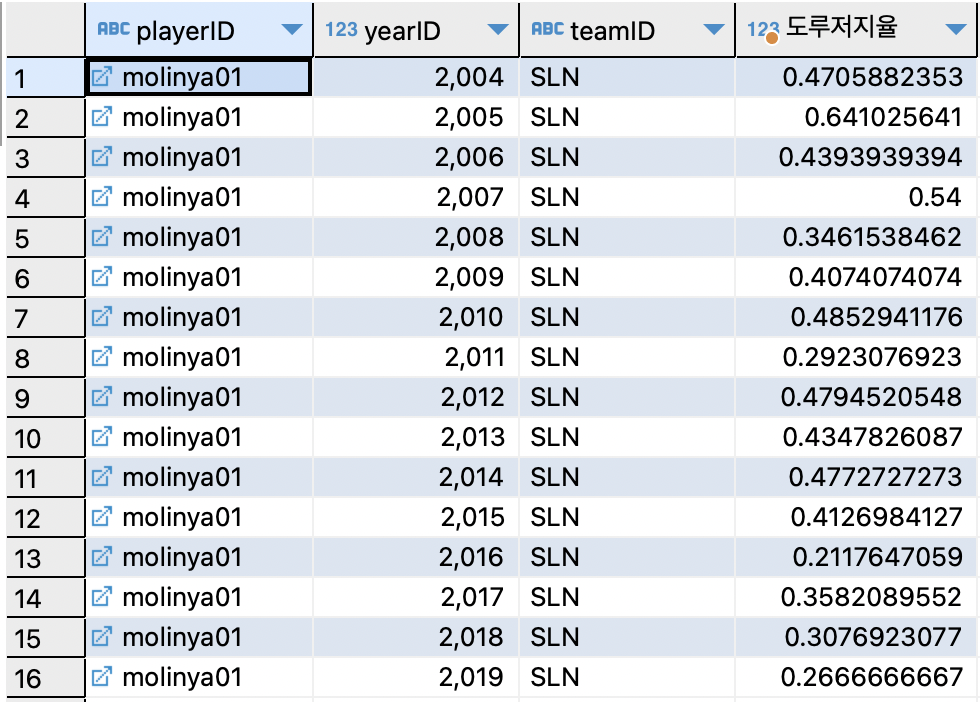

### 2019년 MLB 홈런왕 기록 조회하기

```sql
SELECT
  playerID, HR
FROM batting
WHERE yearID = 2019
ORDER BY HR DESC
LIMIT 1
```

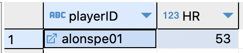

JOIN을 활용하여 이름도 같이 조회하기

```sql
SELECT
  b.playerID, p.nameFirst, p.nameLast, b.HR
FROM batting AS b
LEFT OUTER JOIN people AS p
ON b.playerID = p.playerID
WHERE b.yearID = 2019
ORDER BY b.HR DESC
LIMIT 1;
```

```
Quiz 13. 2019년 MLB 투수 탈삼진 TOP 5 기록을 이름과 함께 조회

아래와 같은 결과가 조회되게 하는 SQL문을 작성하시오.
```

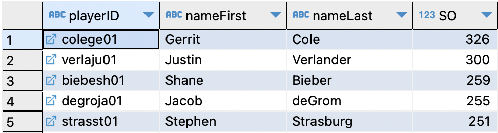

### 2019년 MLB 타율 순위 조회하기

타율과 같은 비율 스탯의 랭킹을 구할 때는 규정타석 또는 규정이닝을 고려해야 함.

규정타석 또는 규정이닝을 채운 선수만 랭킹 산정에 포함.

|리그|규정타석|
|---|---|
|MLB|전체 경기수(162) * 3.1, 소수 반올림 = 502타석|
|NPB|전체 경기수(143) * 3.1, 소수 반올림 = 443타석|
|KBO|전체 경기수(144) * 3.1, 소수점 아래 버림 = 446타석|

|리그|규정이닝|
|---|---|
|MLB|전체 경기수(162) * 1 = 162이닝|
|NPB|전체 경기수(143) * 1 = 143이닝|
|KBO|전체 경기수(144) * 1 = 144이닝|

```sql
SELECT
  playerID, (H + 0.0)/ AB AS AVG
FROM batting
WHERE yearID = 2019
  AND (AB + BB + HBP + SH + SF) >= 502
ORDER BY AVG DESC
LIMIT 10;
```

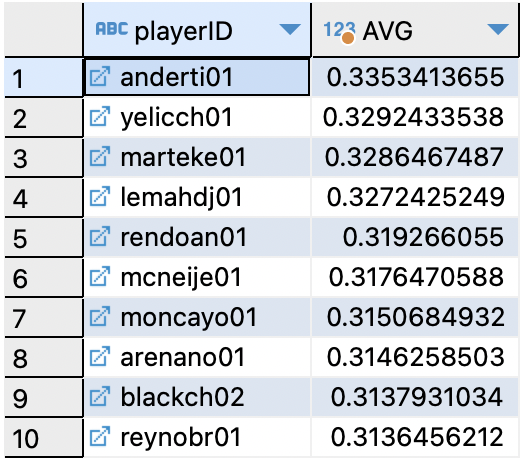

JOIN을 활용하여 이름도 함께 조회.

```sql
SELECT
  b.playerID, p.nameFirst, p.nameLast, (b.H + 0.0) / b.AB AS AVG
FROM batting AS b
LEFT OUTER JOIN people AS p
  ON b.playerID = p.playerID
WHERE b.yearID = 2019
  AND (b.AB + b.BB + b.HBP + b.SH + b.SF) >= 502
ORDER BY AVG DESC
LIMIT 10;
```

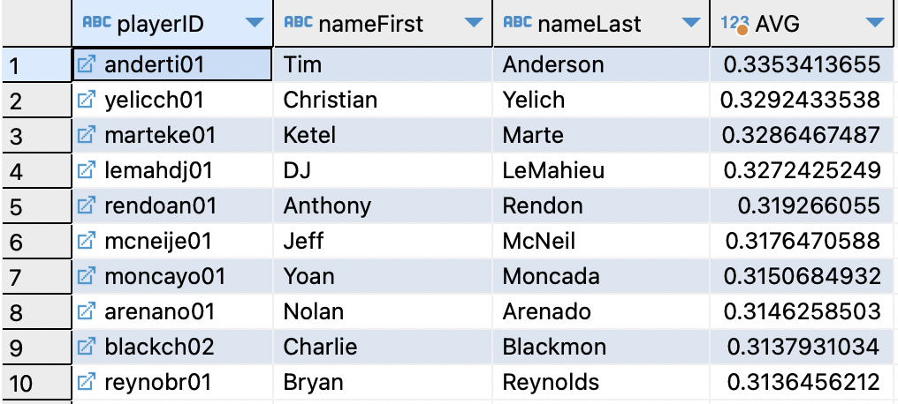

```
Quiz 14. 2019년 투수 WHIP TOP 5 기록을 이름과 함께 조회

이닝과 관련된 컬럼: IPouts, 아웃카운트 개수

아래와 같은 결과가 조회되게 하는 SQL문을 작성하시오.
```

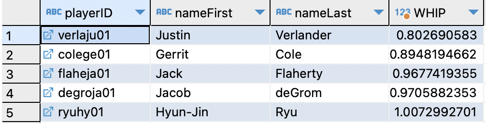

### 2019년에 커쇼가 기록한 탈삼진보다 더 많은 탈삼진을 기록한 투수 기록 조회

우선 2019년에 커쇼가 기록한 탈삼진 개수 조회.

```sql
SELECT
  pitching.playerID, people.nameFirst, people.nameLast, pitching.SO
FROM pitching
LEFT OUTER JOIN people
  ON pitching.playerID = people.playerID
WHERE people.nameLast = 'Kershaw'
  AND pitching.yearID = 2019;  -- 189
```

서브 쿼리 활용.

```sql
SELECT
  playerID, SO
FROM pitching
WHERE 
  yearID = 2019
  AND SO > (SELECT
    SO
  FROM pitching
  WHERE playerID = 'kershcl01'
    AND pitching.yearID = 2019
  )
ORDER BY SO DESC;
```

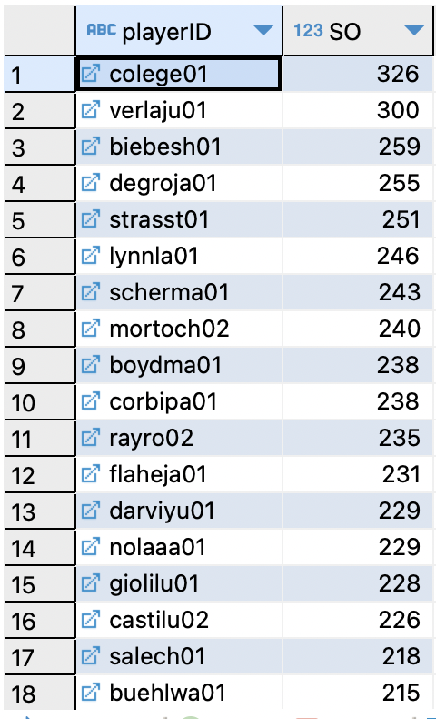

### 2015년에 오른손 타자 중에 안타를 가장 많이 친 선수 5명 조회

```sql
SELECT
  b.yearID, p.nameFirst, p.nameLast, p.bats, b.H
FROM batting AS b
LEFT OUTER JOIN people AS p
  ON b.playerID = p.playerID
WHERE b.yearID = 2015
  AND p.bats = 'R'
ORDER BY b.H DESC
LIMIT 5;
```

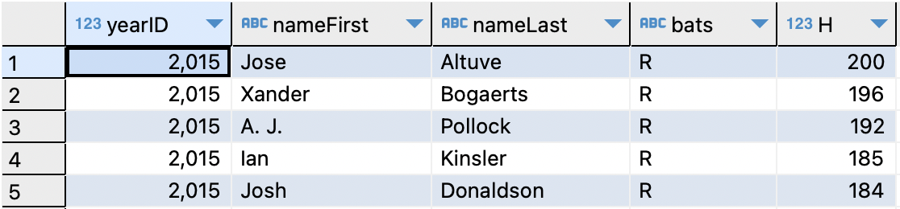
