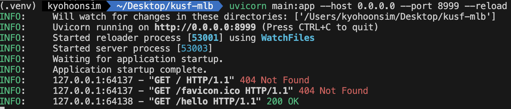

# 파이썬 백엔드 서버 만들기

우리는 FastAPI라는 프레임워크를 활용하여 파이썬으로 백엔드 API 서버를 만들 것임.

## 필요 패키지 설치

- pip install fastapi
- pip install "uvicorn[standard]"

설치를 완료했다면, pip list로 패키지 목록을 확인해볼 것.

---

## 세상에서 가장 간단한 API 서버 띄우기

main.py라는 파일을 하나 만들 것

```python
# main.py
from fastapi import FastAPI


app = FastAPI()


@app.get("/hello")
def hello_route():
    return "hello, world"
```

서버 실행 명령: `uvicorn main:app --host 0.0.0.0 --port 8999 --reload`

아마 다음과 같은 내용이 콘솔에 출력되면서 서버가 실행될 것.



크롬 등과 같은 웹 브라우저에서 127.0.0.1:8999/hello를 주소창에 기입하여 접속해보세요.

127.0.0.1:8999/docs 와 127.0.0.1:8999/redoc 에 접속하면 자동 생성된 API 문서도 확인할 수 있습니다.

---

## HTTP 메소드

- GET: 조회
- POST: 생성
- PUT or PATCH: 수정
- DELETE: 삭제

---

## 서버로 값 전달하는 방법

1. URL에서 보이는 방식으로 전달
    - path parameter (경로 매개변수): URL 경로에 들어가는 변수
    - query parameter (쿼리 매개변수): URL에서 ? 뒤에 키-값 쌍으로 추가되는 변수

2. URL에서 보이지 않는 방식으로 전달
    - Request Body (요청 본문): HTTP 요청에 데이터를 포함하는 부분
    - Header parameter (헤더 매개변수): HTTP 요청의 헤더에 포함된 매개변수. 요청의 메타데이터와 관련있음. 데이터 자체가 아니라 요청에 대한 추가 정보를 제공.

---

## 레먼 데이터베이스의 데이터를 API 서버를 통해 제공하기

먼저 crud.py를 다음과 같이 수정.

3개의 함수를 만들었음.

```python
from sqlalchemy import create_engine, text


SQLALCHEMY_DATABASE_URL = "sqlite:///./lahmansbaseballdb.sqlite"

engine = create_engine(
    SQLALCHEMY_DATABASE_URL
)


def read_player_batting_data(playerID: str):
    with engine.connect() as conn:
        rows = conn.execute(
            text("select * from batting where playerID = :playerID"),
            {'playerID': playerID}
        )

    columns = rows.keys()

    data = []
    for row in rows:
        data_dict = {column: row[idx] for idx, column in enumerate(columns)}
        data.append(data_dict)

    return data


def read_player_pitching_data(playerID: str, yearID: str):
    with engine.connect() as conn:
        rows = conn.execute(text("select * from pitching where playerID = :playerID AND yearID = :yearID"), {'playerID': playerID, 'yearID': yearID})
        
    columns = rows.keys()
    
    data = []
    for row in rows:
        data_dict = {column: row[idx] for idx, column in enumerate(columns)}
        data.append(data_dict)
    
    return data


def read_player_info(playerID: str):
    with engine.connect() as conn:
        rows = conn.execute(text("select * from people where playerID = :playerID"), {'playerID': playerID})
        
    columns = rows.keys()
    
    data = []
    for row in rows:
        data_dict = {column: row[idx] for idx, column in enumerate(columns)}
        data.append(data_dict)
    
    return data
```

이번에는 main.py를 다음과 같이 수정한다.

```python
from fastapi import FastAPI, Body

import crud


app = FastAPI(title="레먼데이터베이스 API")


@app.get("/players/{playerID}")  # 경로 매개변수 활용 예시
def player_info_route(playerID: str):
    return crud.read_player_info(playerID)


@app.get("/batting")  # 쿼리 매개변수 활용 예시
def batting_route(playerID: str):
    return crud.read_player_batting_data(playerID)


@app.post("/pitching")  # Request Body 활용 예시
def pitching_route(
    playerID: str = Body(...),
    season: int = Body(...)
):
    return crud.read_player_pitching_data(playerID, season)
```

uvicorn 서버를 실행한 후 swagger docs 사이트에 접속해서 테스트해보자.

> 실습: 2개의 함수를 crud.py에 추가하고, 그에 대응하는 endpoint를 main.py에 추가할 것.

---

## FastAPI로 여러분이 기획한 웹 서비스의 핵심 데이터를 제공하는 API 서버 만들기

1. 테이블 생성 및 데이터 적재

    - PlanetScale에 테이블을 생성하고 샘플 데이터를 적재한다.

2. sqlite3 데이터베이스 대신 PlanetScale 데이터베이스 연동

3. crud.py에 유저에게 제공하고자 하는 데이터를 crud하는데 필요한 함수들 추가

4. main.py에 해당 데이터를 API로 제공할 수 있도록 route 추가
